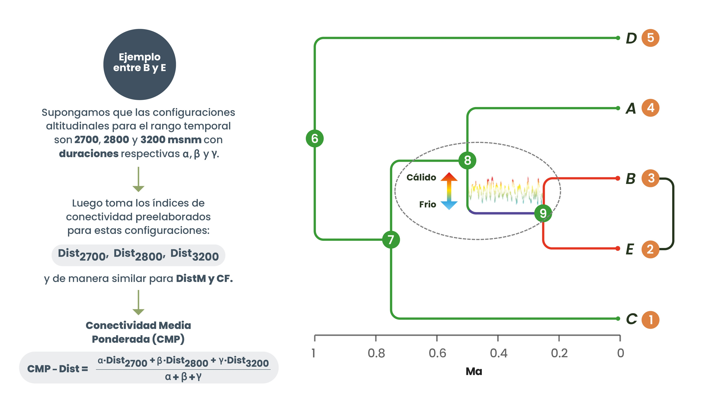
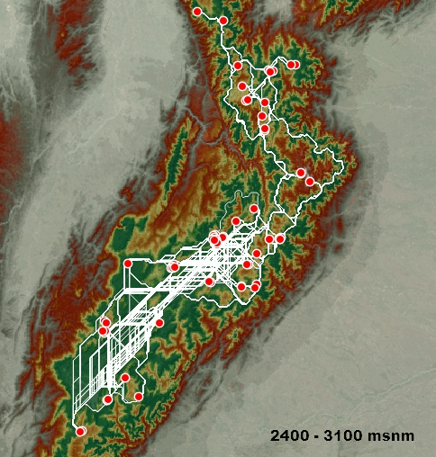

# 
Cálculo de conectividad histórica

El siguiente algoritmo fue diseñado para calcular la conectividad histórica entre pares de linajes, con el objetivo de analizar la relación entre esta conectividad y las distancias evolutivas entre ellos. Para lograrlo, se utilizan los tiempos correspondientes al intervalo entre nodos padre e hijo para todos los pares posibles en un árbol ultramétrico (véase Figura 1, ejemplo: tiempo entre los nodos 8 y 9). Estos tiempos representan, hipotéticamente, los eventos que llevaron a la divergencia entre linajes, en contextos como las fluctuaciones climáticas del Pleistoceno, las cuales influyeron en los períodos de mayor o menor conectividad, resultando en la divergencia.

El algoritmo también utiliza una base de datos de la columna de polen estudiada en *Flantua et al.* (2019), que abarca **1,645 instantes en el tiempo**. Cada uno de estos instantes refleja una configuración de páramo específica y su duración en millones de años. A partir de esta base de datos, el algoritmo extrae las configuraciones de páramo y sus duraciones correspondientes a los intervalos de tiempo entre nodos padre e hijo. Luego, incorpora los índices de conectividad precalculados (**Dist, DistM y CF**. Estos tres índices se emplean en el análisis de conectividad, donde Dist evalúa la ruta de menor costo, mientras que CF considera todas las rutas potenciales en términos de corriente eléctrica.) (ver Figura 2) para estas configuraciones, ponderando cada configuración por su duración.

De esta manera, se obtiene un valor único, el cual es un promedio ponderado que representa la conectividad histórica durante el intervalo de tiempo entre los nodos padre e hijo. Este valor tiene el objetivo de resaltar la influencia de las diferentes estructuras de páramo en la divergencia evolutiva de los linajes, proporcionando una medida integrada de la conectividad histórica basada en las condiciones paleoclimáticas y la dinámica hipotética de los páramos.

Para ilustrar esta metodología, se presenta un ejemplo hipotético que se aplica de manera similar a todas las combinaciones posibles de pares de terminales en una filogenia. Consideremos el par de especies B y E de la Figura 1. El algoritmo primero identifica el tiempo de divergencia entre B y E, correspondiente al nodo 9, que ocurre aproximadamente a **0.22 millones de años (Ma)**. A continuación, determina el tiempo del nodo padre correspondiente al nodo 9, que es aproximadamente **0.5 Ma**.

Con estos datos, el algoritmo consulta la base de datos de la columna de polen de *Flantua et al.* (2019) para seleccionar el rango temporal correspondiente al intervalo entre los nodos 8 y 9. Durante este rango de tiempo, se presentan diversas configuraciones altitudinales del páramo, cada una con su duración respectiva. Utilizando estos datos, se procede a calcular la conectividad histórica media ponderada (**CMP**), como se ejemplifica a continuación:

1.  Supongamos que las configuraciones altitudinales para el rango temporal entre los nodos 8 y 9 son **2700, 2800 y 3200 metros sobre el nivel del mar (msnm)**, con duraciones respectivas **α, β y γ**.

2.  Los índices de conectividad preelaborados para estas configuraciones son **Dist2700, Dist2800 y Dist3200** para el índice **Dist**. De manera similar, se disponen de índices para **DistM** y **CF**. Estos tres índices se emplean en el análisis de conectividad, donde **Dist** evalúa la ruta de menor costo, mientras que **CF** considera todas las rutas potenciales en términos de corriente eléctrica.

3.  La conectividad histórica media ponderada (**CMP**) para el índice **Dist** se calcula de la siguiente manera:

...

$$
\text{CMP-Dist} = \frac{(\alpha \cdot \text{Dist2700} + \beta \cdot \text{Dist2800} + \gamma \cdot \text{Dist3200})}{\alpha + \beta + \gamma}
$$

...

Este mismo procedimiento se repite para los otros índices, **DistM** y **CF**, resultando en los valores **CMP-Dist**, **CMP-DistM** y **CMP-CF**. Estos valores sintetizan la conectividad histórica entre el par específico de organismos B y E durante el periodo de tiempo considerado.

...

```{r echo=FALSE, fig.align='center', fig.cap="**Figura 1.** *Ejemplo de filogenia con referencia a tiempo ultramétrico.* La filogenia muestra la relación evolutiva entre las especies A, B, C, D y E (indicadas numéricamente en naranja), donde cada nodo numérico (en verde) representa un ancestro común. La barra de tiempo debajo de la filogenia ofrece una referencia visual del tiempo ultramétrico en millones de años para todo el árbol. Las líneas rojas representan un caso hipotético de estudio entre el par B y E. En este ejemplo, se estudia el periodo de tiempo entre los nodos 8 y 9, indicado por una línea purpura, donde se ilustran las fluctuaciones climáticas del Pleistoceno. Este esquema ejemplifica el cálculo de los tiempos de divergencia entre nodos, como se describe en la metodología del estudio.", out.width='90%'}



```

...

```{r echo=FALSE, fig.align='center', fig.cap="**Figura 2.** *Configuraciones de páramos basadas en el estudio de Flantua et al. (2019).* Este GIF muestra todas las posibles configuraciones de páramos en el modelo de Flantua et al. (2019). En la parte inferior se indican los rangos de páramo que representa cada imagen. El ejemplo incluye la cordillera oriental, donde los puntos rojos indican las ubicaciones de las muestras de frailejones. Las líneas blancas representan únicamente los índices Dist y DistM, excluyendo el índice CF. Los índices Dist y DistM reflejan la distancia de menor costo en unidades de costo y en metros, respectivamente. Los colores en el GIF representan los costos al movimiento: las tonalidades verdes indican menor costo, mientras que las tonalidades grises reflejan mayores costos. Es importante destacar que este GIF no representa una secuencia temporal. En lugar de mostrar cómo evolucionaron los páramos del pasado al presente, ilustra las configuraciones de páramo durante las fluctuaciones climáticas del Pleistoceno, las cuales ocurrieron en diferentes momentos y no en un orden fijo.", out.width='57%'}



```

...

## **Algoritmo empleado** 

##### 
*Al final, se presenta el resultado para un par de organismos o parches, incluyendo los mensajes impresos de cada paso del proceso de ejecución.*

```{r echo=TRUE}

# Leer los datos de duración y las configuraciones de páramo del estudio de Flantua et al. (2019)
datos_duracion <- read.csv("C:/Users/Usuario/Desktop/Archivos_tesis/Matrices_UFL/UFL_duration.csv", stringsAsFactors = FALSE)

# Leer la matriz con los tiempos de los nodos padre del árbol ultramétrico
matriz_limites <- read.csv("C:/Users/Usuario/Desktop/Archivos_tesis/Padre-Hijo_Tiempo/Padre-hijo_Clado_Colombiano - copia.csv", stringsAsFactors = FALSE, row.names = 1)

# Leer la matriz con los tiempos de los nodos hijo del árbol ultramétrico
matriz_tiempos <- read.csv("C:/Users/Usuario/Desktop/Archivos_tesis/Tiempos_divergencia/Tiempos_divergencia_Clado_Colombiano - copia.csv", stringsAsFactors = FALSE, row.names = 1)


###################################################################################################


# Se define una función para encontrar el valor más cercano en la columna "Age". Esto es necesario porque los tiempos estudiados entre el nodo padre e hijo no siempre coinciden exactamente con los tiempos disponibles en esta columna. Por lo tanto, la función busca el valor más cercano como punto de partida.

encontrar_valor_cercano <- function(valor, columna) {
  valor_cercano <- columna[which.min(abs(columna - valor))]
  return(valor_cercano)
}

# Inicializar un marco de datos para almacenar los resultados finales
resultados_finales <- data.frame(ID1 = character(), ID2 = character(), Dist = numeric(), DistM = numeric(), CF_beta0_graph1 = numeric(), CF_beta1_graph1 = numeric(), stringsAsFactors = FALSE)

# Iterar sobre cada par de IDs
for (i in 1:(nrow(matriz_tiempos) - 1)) {
  for (j in (i + 1):nrow(matriz_tiempos)) {  
    # Obtener el par de IDs actual
    ID1 <- rownames(matriz_tiempos)[i]
    ID2 <- rownames(matriz_tiempos)[j]
    
    # Calcular el tiempo de divergencia entre los pares de IDs
    valor_tiempo <- as.numeric(matriz_tiempos[i, j])
    
    # Verificar si el valor de tiempo es numérico y no está en la diagonal principal
    if (!is.na(valor_tiempo) && valor_tiempo != 0) {
      cat("Procesando IDs:", ID1, "-", ID2, "\n")
      cat("Valor de tiempo de nodo hijo:", valor_tiempo, "\n")
      
      # Buscar el valor más cercano en la columna "Age"
      valor_cercano_inicio <- encontrar_valor_cercano(valor_tiempo, datos_duracion$Age)
      cat("Valor más cercano en la columna 'Age' para el inicio de la suma de las columnas de las duraciones en MA para cada configuración de páramo:", valor_cercano_inicio, "\n")
      
      # Obtener el límite de la suma desde matriz_limites
      limite_suma <- as.numeric(matriz_limites[i, j])  
      cat("Límite hasta donde debe sumar las columnas obtenido desde matriz_limites:", limite_suma, "\n")
      
      # Buscar el valor más cercano en la columna "Age" para el límite de la suma
      valor_cercano_fin <- encontrar_valor_cercano(limite_suma, datos_duracion$Age)
      cat("Valor más cercano en la columna 'Age' para el fin de la suma:", valor_cercano_fin, "\n")
      
      # Calcular la suma de los valores desde el inicio hasta el límite especificado en matriz_limites
      indice_fila_inicio <- which(datos_duracion$Age == valor_cercano_inicio)[1]
      indice_fila_fin <- which(datos_duracion$Age == valor_cercano_fin)[1]
      suma_valores <- colSums(datos_duracion[indice_fila_inicio:indice_fila_fin, 7:28], na.rm = TRUE)  
      cat("Suma de los valores de las duraciones de las configuraciones de páramo desde el inicio hasta el límite especificado en matriz_limites:\n")
      print(suma_valores)
      
      # Identificar los totales que son mayores que cero
      totales_positivos <- suma_valores[suma_valores > 0]
      cat("Totales positivos:", totales_positivos, "\n")
      
      # Obtener los números de los encabezados de las columnas con valores mayores que cero. 
# Esto se realiza porque los archivos de los índices de conectividad precalculados tienen nombres que comienzan con un número específico seguido en el nombre con la configuración de páramo que representa. 
# Este prefijo numérico representa una configuración de páramo particular, la cual se utiliza como base para buscar los índices de conectividad específicos correspondientes a cada configuración en estos archivos.

      indices_columnas <- as.numeric(gsub("X", "", names(totales_positivos)))
      cat("Numeros correspondientes de los encabezados de las columnas con valores mayores que cero:", indices_columnas, "\n")
      
      # Obtener los prefijos númericos extraidos del paso anterior
      archivos_indices_nombres <- paste0("^(", paste(indices_columnas, collapse = "|"), "_)")
      
      # Filtrar los archivos correspondientes a los prefijos númericos en la carpeta de resultados
      archivos_indices <- list.files("C:/Users/Usuario/Desktop/Archivos_tesis/Graphab_resultados/Resultados_lmetrics", 
                                     pattern = archivos_indices_nombres, 
                                     full.names = TRUE)
      
      # Ordenar los archivos según los números obtenidos, de esta forma, se asegura que los calculos siguientes se realicen en el mismo orden anterior sobre los archivos extraidos
      archivos_indices <- archivos_indices[order(as.numeric(gsub(".*/(\\d+)_.*", "\\1", archivos_indices)))]
      
      # Inicializar vectores para almacenar sumas ponderadas (conectividad historica)
      suma_ponderada_Dist <- numeric(0)
      suma_ponderada_DistM <- numeric(0)
      suma_ponderada_CF_beta0_graph1 <- numeric(0)
      suma_ponderada_CF_beta1_graph1 <- numeric(0)
      
      # Iterar sobre los archivos correspondientes
      for (k in seq_along(archivos_indices)) {
        # Leer el archivo
        datos_archivo <- read.csv(archivos_indices[k], stringsAsFactors = FALSE)

        # Filtrar los datos para el par de IDs actual (en ambos órdenes)
        datos_filtrados_1 <- datos_archivo[datos_archivo$ID1 == ID1 & datos_archivo$ID2 == ID2, ]
        datos_filtrados_2 <- datos_archivo[datos_archivo$ID1 == ID2 & datos_archivo$ID2 == ID1, ]
        
        # Verificar si hay datos filtrados
        if (nrow(datos_filtrados_1) > 0) {
        
          # Calcular las sumas ponderadas
          suma_Dist <- sum(datos_filtrados_1$Dist) 
          suma_DistM <- sum(datos_filtrados_1$DistM) 
          suma_CF_beta0_graph1 <- sum(datos_filtrados_1$CF_beta0_graph1) 
          suma_CF_beta1_graph1 <- sum(datos_filtrados_1$CF_beta1_graph1) 
          
          suma_ponderada_Dist <- c(suma_ponderada_Dist, suma_Dist * totales_positivos[k])
          suma_ponderada_DistM <- c(suma_ponderada_DistM, suma_DistM * totales_positivos[k])
          suma_ponderada_CF_beta0_graph1 <- c(suma_ponderada_CF_beta0_graph1, suma_CF_beta0_graph1 * totales_positivos[k])
          suma_ponderada_CF_beta1_graph1 <- c(suma_ponderada_CF_beta1_graph1, suma_CF_beta1_graph1 * totales_positivos[k])
        }
        if (nrow(datos_filtrados_2) > 0) {
          
          # Calcular las sumas ponderadas
          suma_Dist <- sum(datos_filtrados_2$Dist) 
          suma_DistM <- sum(datos_filtrados_2$DistM) 
          suma_CF_beta0_graph1 <- sum(datos_filtrados_2$CF_beta0_graph1) 
          suma_CF_beta1_graph1 <- sum(datos_filtrados_2$CF_beta1_graph1) 
          
          
          suma_ponderada_Dist <- c(suma_ponderada_Dist, suma_Dist * totales_positivos[k])
          suma_ponderada_DistM <- c(suma_ponderada_DistM, suma_DistM * totales_positivos[k])
          suma_ponderada_CF_beta0_graph1 <- c(suma_ponderada_CF_beta0_graph1, suma_CF_beta0_graph1 * totales_positivos[k])
          suma_ponderada_CF_beta1_graph1 <- c(suma_ponderada_CF_beta1_graph1, suma_CF_beta1_graph1 * totales_positivos[k])
        }
      }
      
      # Imprimir sumas ponderadas finales
      print("Sumas ponderadas finales:")
      print(suma_ponderada_Dist)
      print(suma_ponderada_DistM)
      print(suma_ponderada_CF_beta0_graph1)
      print(suma_ponderada_CF_beta1_graph1)
      
      # Calcular la ponderación final
      ponderacion_final_Dist <- sum(suma_ponderada_Dist, na.rm = TRUE) / sum(totales_positivos)
      ponderacion_final_DistM <- sum(suma_ponderada_DistM, na.rm = TRUE) / sum(totales_positivos)
      ponderacion_final_CF_beta0_graph1 <- sum(suma_ponderada_CF_beta0_graph1, na.rm = TRUE) / sum(totales_positivos)
      ponderacion_final_CF_beta1_graph1 <- sum(suma_ponderada_CF_beta1_graph1, na.rm = TRUE) / sum(totales_positivos)
      
      # Imprimir resultados finales
      print("Resultados finales:")
      print(ponderacion_final_Dist)
      print(ponderacion_final_DistM)
      print(ponderacion_final_CF_beta0_graph1)
      print(ponderacion_final_CF_beta1_graph1)
      
      # Almacenar los resultados finales
      resultados_finales <- rbind(resultados_finales, data.frame(ID1 = ID1, ID2 = ID2, Dist = ponderacion_final_Dist, DistM = ponderacion_final_DistM, CF_beta0_graph1 = ponderacion_final_CF_beta0_graph1, CF_beta1_graph1 = ponderacion_final_CF_beta1_graph1))
    }
  }
}

# Guardar los resultados finales en un archivo CSV
write.csv(resultados_finales, file = "C:/Users/Usuario/Desktop/Archivos_tesis/Resultados_finales/Resultados_finales.csv", row.names = FALSE)

```
